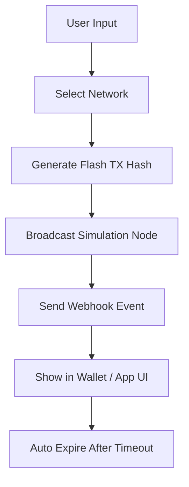

# 💧 USDT Flash Sender — Simulated Crypto Transfer Tool (2025 Edition)

**USDT Flash Sender** is a next-generation **transa ction simulator** built for developers, testers, and blockchain educators who need to **demonstrate or test USDT transfers** without risking real funds. It supports **multi-network simulation** (ERC20, TRC20, BEP20) and mimics the structure, confirmation timing, and metadata of authentic transfers.

This software doesn’t move actual USDT but **generates traceable, time-bound trans action artifacts** for testing UI, analytics, or blockchain integration.

---


---

## ⚙️ Overview

When building payment systems, exchanges, or wallets, it’s crucial to **verify blockchain operations safely**.
USDT Flash Sender enables you to:

* **Simulate incoming/outgoing USDT transfers**
* **Preview blockchain confirmations** (0/6/12 block depth)
* **Test transaction handlers** in your app or bot
* **Generate valid transaction hashes** for demonstration

Every flash transaction is **temporarily broadcasted** in a sandbox node environment, allowing you to validate UI, API, and Web3 responses realistically.

---

## 🌐 Supported Networks

| Network         | Token Standard | Simulation Depth | Explorer Mode   |
| --------------- | -------------- | ---------------- | --------------- |
| Ethereum        | ERC20          | Full / Partial   | Etherscan Mock  |
| TRON            | TRC20          | Partial          | TRXScan View    |
| BNB Smart Chain | BEP20          | Full             | BSCScan Mirror  |
| Polygon         | ERC20          | Limited          | PolygonScan API |

[!IMPORTANT]
No real tokens are transferred. All transactions are virtual and revert automatically within a testnet or simulated block memory.

---

## 🔧 Key Features

### 🧩 Multi-Chain Emulation

Run flash transactions across Ethereum, BNB, and TRON simultaneously — perfect for **cross-chain dashboard testing**.

### 🔁 Expiry-Based Simulation

Each flash USDT transaction auto-expires after 60–300 seconds, helping you **analyze temporary ledger behavior** in scripts or API responses.

### 📦 Custom TX Metadata

Configure:

```json
{
  "from": "0xSenderAddress",
  "to": "0xReceiverAddress",
  "amount": "500 USDT",
  "network": "BEP20",
  "confirmation": 3
}
```

### 🧠 Smart Contract Test Mode

Trigger pseudo-events like:

* `Transfer()`
* `Approval()`
* `Burn()` or `Mint()` for testing governance or liquidity logic.

### 💻 Developer Console

Includes built-in **CLI + GUI hybrid** interface with:

* Node.js script mode (`flashsend.js`)
* REST API endpoints for automation
* Visual confirmation logs

---

## ⚡️ Setup Guide

### Step 1: Install

```bash
git clone https://github.com/flashlabs/usdt-flash-sender.git
cd usdt-flash-sender
npm install
```

### Step 2: Launch Simulation

```bash
npm run flash --network TRC20 --amount 250 --receiver Txxx...address
```

### Step 3: Verify

Use your wallet or dApp’s transaction history screen to **see simulated entries** appear and disappear as expected.

[!NOTE]
To test webhook callbacks, enable the `--callback` flag with a local endpoint URL.

---

## 🪄 Flow Diagram



---

## 🧰 Compatibility & System Requirements

| OS                | Status | Notes                 |
| ----------------- | ------ | --------------------- |
| Windows 10/11     | ✅      | Full GUI support      |
| macOS (Intel/ARM) | ✅      | CLI mode only         |
| Linux             | ✅      | Requires Node.js ≥ 18 |
| Android Termux    | ⚠️     | Experimental          |
| iOS               | ❌      | Not supported         |

*Minimum RAM:* 2 GB
*Disk Space:* 200 MB
*Dependencies:* Node.js, Web3.js, Axios

---

## ❓ FAQ

**Q: Does it send real USDT?**
A: No — all transactions are simulated for visual and integration testing only.

**Q: Can I use it with my Telegram or Discord bot?**
A: Yes. Flash Sender exposes an API endpoint perfect for webhook integrations.

**Q: How long does a flash transaction stay visible?**
A: Between 60 and 300 seconds, depending on your configuration.

**Q: Is it safe to use in production apps?**
A: It’s intended for testing, demos, and QA environments only — not live financial transfers.

**Q: Can it mimic failed transactions?**
A: Yes, use the `--failrate` flag to simulate network errors or gas shortage events.

---

## 🧭 Final Thoughts

**USDT Flash Sender** bridges the gap between **development realism and operational safety**.
By emulating the timing, formatting, and lifecycle of real blockchain transactions, it allows engineers, educators, and QA teams to build confidently — **without losing a single token.**

---

*Build. Test. Simulate. — The Flash Way.* ⚡
